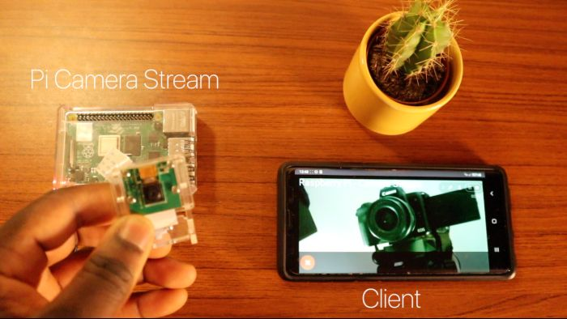
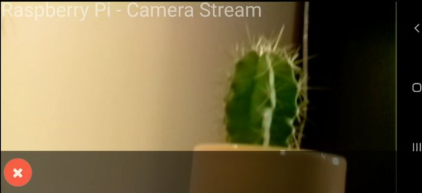

# Make you own Raspberry Pi Camera Stream

Create your own live stream from a Raspberry Pi using the Pi camera module. Build your own applications from here.

## How it works
The Pi streams the output of the camera module over the web via Flask. Devices connected to the same network would be able to access the camera stream via

```
<raspberry_pi_ip:5000> 
```

## Screenshots
|  |  |
| ------------------------------------- | ------------------------------------------------------------- |
| Pi Setup                              | Pi - Live Stream                                              |

## Preconditions

* Raspberry Pi 4, 2GB is recommended for optimal performance. However you can use a Pi 3 or older, you may see a increase in latency.
* Raspberry Pi 4 Camera Module or Pi HQ Camera Module (Newer version)
* Python 3 recommended.

## Library dependencies
Install the following dependencies to create camera stream.

```
sudo apt-get update 
sudo apt-get upgrade

sudo apt-get install libatlas-base-dev
sudo apt-get install libjasper-dev
sudo apt-get install libqtgui4 
sudo apt-get install libqt4-test
sudo apt-get install libhdf5-dev

sudo pip3 install flask
sudo pip3 install numpy
sudo pip3 install opencv-contrib-python
sudo pip3 install imutils
sudo pip3 install opencv-python


```

Note: This installation of opencv may take a while depending on your pi model. 

OpenCV alternate installation (in the event of failed opencv builds):

```
sudo apt-get install libopencv-dev python3-opencv
```

## Step 1 – Cloning Raspberry Pi Camera Stream
Open up terminal and clone the Camera Stream repo:

```
cd /home/pi
git clone https://github.com/EbenKouao/pi-camera-stream-flask.git
```

## Step 2 – Launch Web Stream

Note: Creating an Autostart of the main.py script is recommended to keep the stream running on bootup.
```bash cd modules
sudo python3 /home/pi/pi-camera-stream-flask/main.py
```

## Step 3 – Autostart your Pi Stream

Optional: A good idea is to make the the camera stream auto start at bootup of your pi. You will now not need to re-run the script every time you want to create the stream. You can do this by going editing the /etc/profile to:

```
sudo nano /etc/profile
```

Go the end of the and add the following (from above):

```
sudo python3 /home/pi/pi-camera-stream-flask/main.py
```

This would cause the following terminal command to auto-start each time the Raspberry Pi boots up. This in effect creates a headless setup - which would be accessed via SSH. 
Note: make sure SSH is enabled.

## More Projects / Next Steps
View more projects that build on the Pi Camera on [smartbuilds.io](https://smartbuilds.io).
